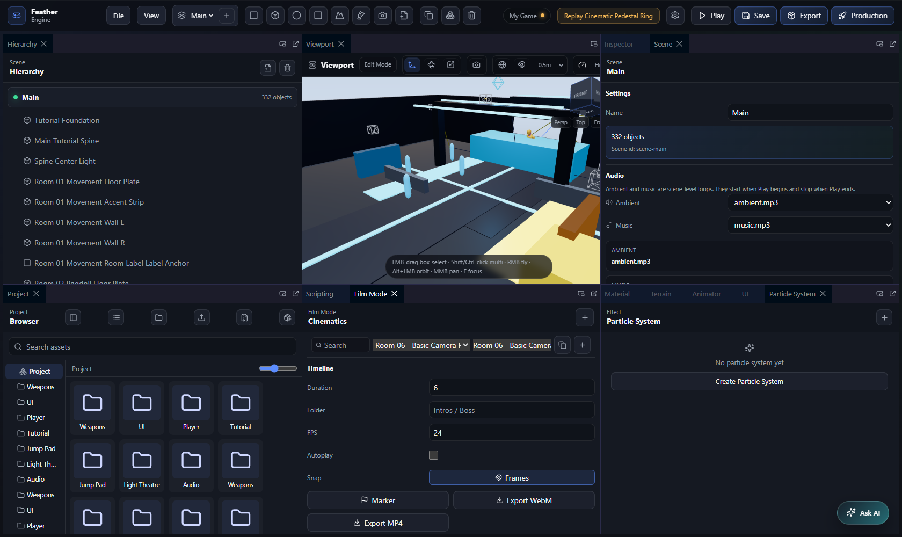
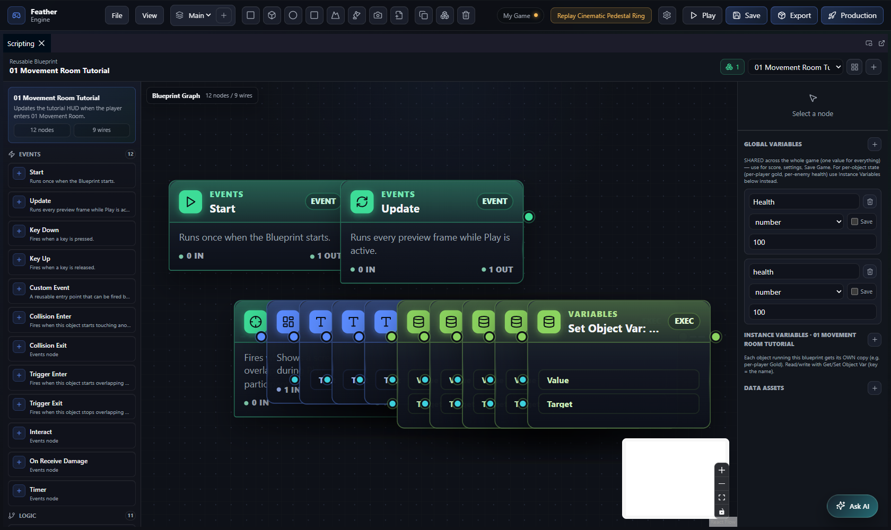
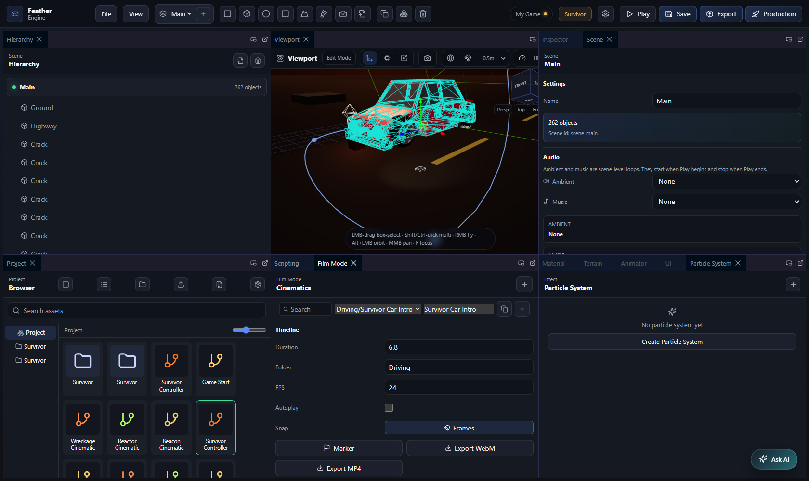
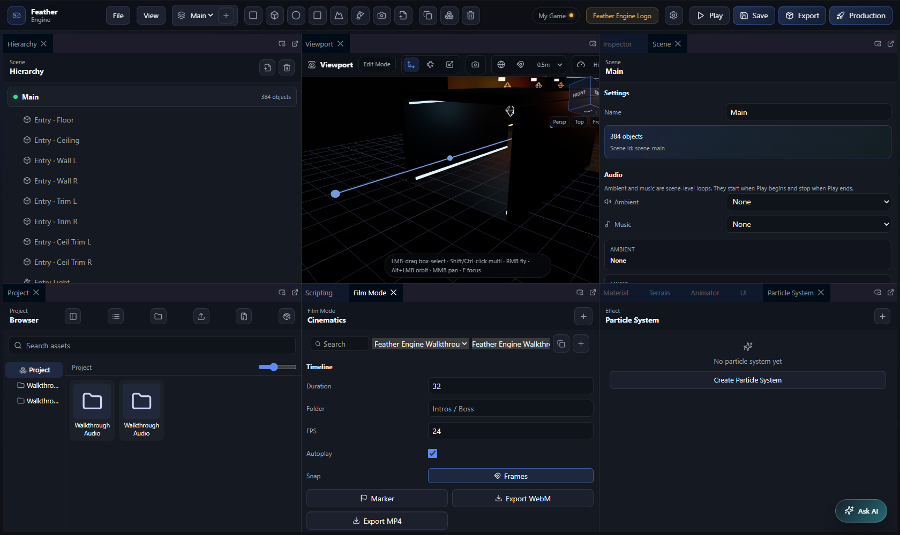
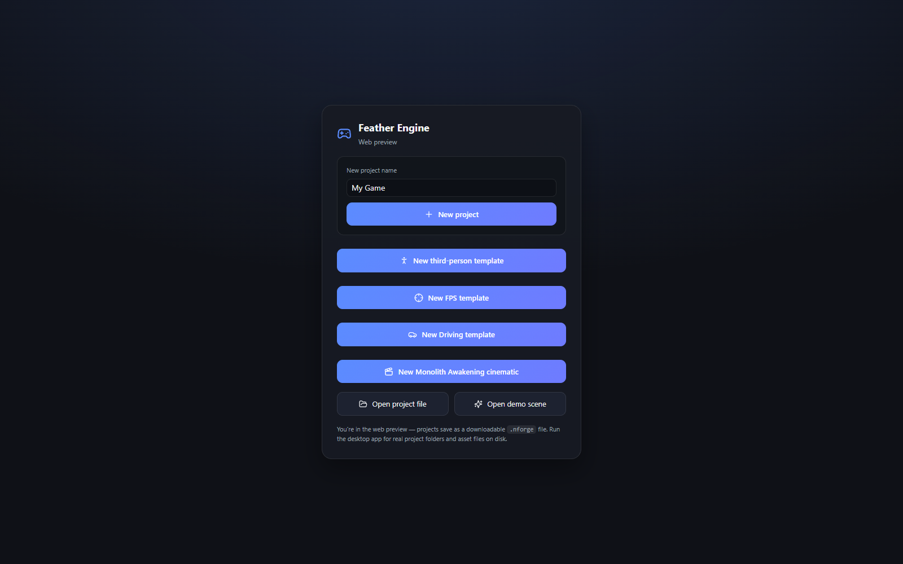

<div align="center">

# 🪶 Feather Engine

**A browser-based 3D game engine editor with node-based visual scripting.**

Build scenes, attach physics, wire up gameplay logic with a blueprint-style graph, and preview it
all live — no compilation, no plugins, just the web.

    

</div>

---

## 🎬 Watch the demo

<div align="center">

[](https://youtu.be/bG56Lbc-PN4)

▶️ **[Watch on YouTube](https://youtu.be/bG56Lbc-PN4)**

</div>

---

## 📸 Screenshots

### The editor

A dockable workspace — Hierarchy, 3D Viewport, Inspector, Asset Browser, and editor panels you can
float, tab, or pop out into their own window.



### Visual scripting

Wire gameplay logic in a blueprint-style node graph: events flow through exec wires, values flow
through typed pins. No code required.



<table>
  <tr>
    <td width="50%">
      <strong>🚗 Driving template</strong><br/>
      Vehicle physics, drive input, and chase cameras out of the box.
      
    </td>
    <td width="50%">
      <strong>🎥 Cinematic / Film Mode</strong><br/>
      A sequencer for camera paths, shots, and storyboarded cutscenes.
      
    </td>
  </tr>
</table>

### Start from a template

Spin up a playable scene instantly — third-person, FPS, driving, or the *Monolith Awakening*
cinematic.

<div align="center">
  
</div>

---

## ✨ Features

- **3D Viewport** — Real-time scene rendering powered by [Three.js](https://threejs.org/) via
  [@react-three/fiber](https://github.com/pmndrs/react-three-fiber), with editor camera, gizmos, and post-processing.
- **Physics** — Rigid bodies, colliders, trigger volumes, collision layers, gravity, damping, vehicles,
  and ragdolls through a headless [Rapier](https://rapier.rs/) world during Play.
- **Visual Scripting** — A node graph editor (built on [@xyflow/react](https://reactflow.dev/)) for
  events, branching, math, variables, runtime actions, physics forces, animation, UI, and audio.
- **Scene Hierarchy & Inspector** — Manage objects (cubes, spheres, capsules, planes, lights, cameras,
  meshes) with editable transform, mesh renderer, material, and physics components.
- **Authoring panels** — Material editor, Particle System editor, Animator, Terrain editor, UI editor,
  and Scene settings — each a dockable, floatable, pop-out panel.
- **Cinematics / Film Mode** — A sequencer for camera paths, shots, and storyboarded cutscenes, with MP4/WebM export.
- **Asset Browser** — Import and organize models, images, and audio into folders.
- **Live Runtime Preview** — Hit Play to run your graph in real time with keyboard input, per-frame
  ticks, collisions, and event dispatch.
- **Save / Load persistence** — In-game save points via graph nodes, plus project save/load.
- **AI Assistant** — An agentic chat assistant that drives the editor through tools — ask it to build,
  edit, and wire up your scene.
- **Templates** — Third-person, FPS, Driving, and a *Monolith Awakening* cinematic, ready to play.
- **Desktop App (Tauri)** — Runs as a native macOS / Windows / Linux app with real project folders on disk.
- **Multiple Scenes** — Unity-style scenes per project; switch the active scene, add / duplicate / rename.

## 🧩 Visual scripting nodes

The graph supports a deep palette across several categories:

| Category | Sample nodes |
|----------|--------------|
| **Events** | Start, Update, Key Down/Up, Custom Event, Collision Enter/Exit, Trigger Enter/Exit, Interact, On Receive Damage, Timer |
| **Logic** | Branch, Compare, AND, OR, NOT, Cast, Cooldown, Do Once, Delay, For Loop, For Each Actor |
| **Math** | Add, Subtract, Multiply, Divide, Modulo, Clamp, Lerp, Distance, vector ops, Make Vector3 |
| **Values** | Number, Random, String, Boolean, Vector3 |
| **Variables** | New / Get / Set Variable, Get / Set Object Var |
| **Runtime** | Translate, Rotate, Move, Jump, Drive, Enter/Exit Vehicle, Raycast, Look At, Spawn, Destroy, Set Camera, Camera Shake, Play Sound, Play Cinematic, Load Scene, Find Actor, animation & material setters, Print |
| **Physics** | Apply Force / Impulse / Torque, Set Physics, Set / Get Velocity, Fracture |
| **Persistence** | Save Game, Load Game, Clear Save |
| **UI** | Show UI, Hide UI, Set UI Text |

## 🛠️ Tech stack

- **[React 18](https://react.dev/)** + **[TypeScript](https://www.typescriptlang.org/)**
- **[Vite](https://vitejs.dev/)** — dev server and build tooling
- **[Three.js](https://threejs.org/)** / **[@react-three/fiber](https://github.com/pmndrs/react-three-fiber)** / **[@react-three/drei](https://github.com/pmndrs/drei)** — 3D rendering
- **[@react-three/rapier](https://github.com/pmndrs/react-three-rapier)** + **[@dimforge/rapier3d](https://rapier.rs/)** — physics
- **[@xyflow/react](https://reactflow.dev/)** — node graph editor
- **[Zustand](https://github.com/pmndrs/zustand)** — state management
- **[dockview](https://dockview.dev/)** — dockable panel workspace
- **[Tailwind CSS](https://tailwindcss.com/)** + **[Framer Motion](https://www.framer.com/motion/)** — styling & animation
- **[Tauri](https://tauri.app/)** — native desktop shell

## 🚀 Getting started

### Prerequisites

- [Node.js](https://nodejs.org/) 18+ and npm

### Installation

```bash
git clone https://github.com/mariojgt/NodeForgeEngine.git
cd NodeForgeEngine
npm install
```

### Development

```bash
npm run dev
```

Then open the URL printed in the terminal (default [http://localhost:1420](http://localhost:1420)).
From the launcher, start a template or open the demo scene.

### Desktop app (Tauri)

Requires the [Rust toolchain](https://rustup.rs/) and platform build tools (Xcode Command Line Tools on macOS).

```bash
npm run tauri:dev    # run the native desktop app with live reload
npm run tauri:build  # package a .app/.dmg (macOS)
```

In the desktop app, **New Project** scaffolds a folder with `project.json`, a `scenes/` directory,
and an `assets/` directory; imported assets are copied into `assets/` and loaded via Tauri's
`asset://` protocol. The web build still exports a portable `.nforge` file.

### Ship a playable game

Use the **Production** button in the desktop editor for the easiest path. It stages the current
game, builds a portable web player, and can wrap it as a native Tauri app for your current OS.

```bash
npm run ship          # portable web folder + zip
npm run ship:native   # portable web folder + zip + native app for this OS
npm run ship:fast     # faster rebuild while iterating
npm run ship:reuse    # fastest content-only re-export; reuses dist-player/
```

See [Production Export](docs/PRODUCTION_EXPORT.md) for the full build flow and troubleshooting notes.

### Build (web)

```bash
npm run build    # type-check + production build into dist/
npm run preview  # preview the production build locally
```

## 📁 Project structure

```
src/
├── App.tsx                          # Editor shell + runtime preview loop
├── main.tsx                         # React entry point
├── types.ts                         # Core scene, component & graph types
├── store/
│   └── editorStore.ts               # Zustand store: scene, runtime & graph state
├── runtime/
│   └── physicsWorld.ts              # Headless Rapier world (authority during Play)
├── ai/                              # Agentic AI chat assistant (tools + system prompt)
└── components/
    ├── Workspace.tsx                # Dockable panel layout (dockview)
    ├── HierarchyPanel.tsx           # Scene object tree
    ├── Viewport.tsx                 # 3D viewport (fiber + rapier)
    ├── InspectorPanel.tsx           # Component editor for selected object
    ├── AssetBrowser.tsx             # Imported assets
    ├── VisualScriptingPanel.tsx     # Node graph editor
    └── CinematicPanel.tsx           # Film Mode sequencer
```

## 🤖 Contributing

This project ships an **agentic AI chat assistant** that drives the editor through tools.
Whenever you add a user-facing capability, you must also teach the assistant about it — see
[docs/AI_ASSISTANT.md](docs/AI_ASSISTANT.md) for the checklist. A feature isn't done until the
AI chat can use it.

## 📌 Status

Feather Engine is an **experimental** project under active development. APIs, the project file
format, and the node palette may change.

## 📄 License

Released under the MIT License. See [LICENSE](LICENSE) for details.
