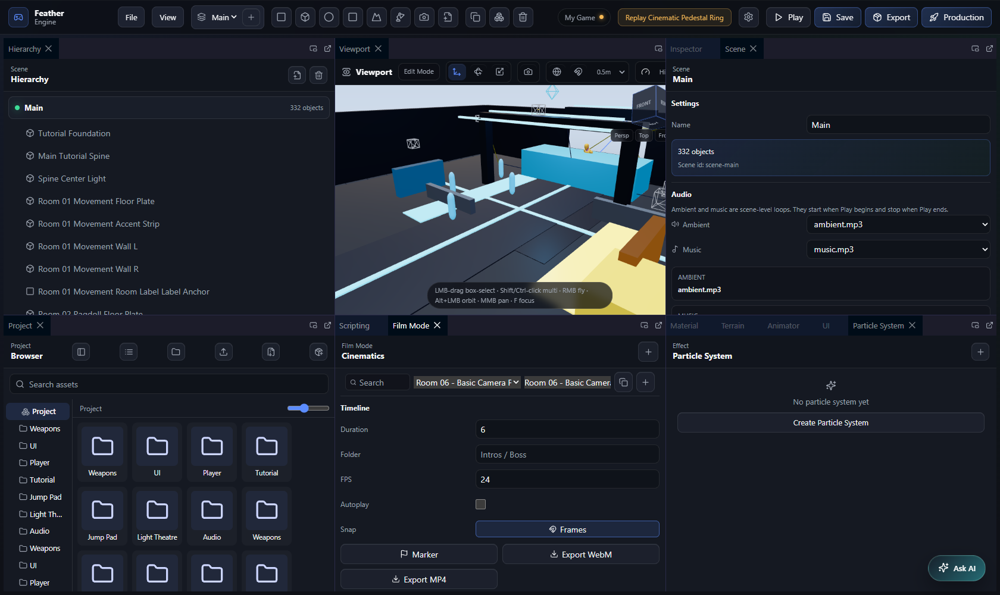
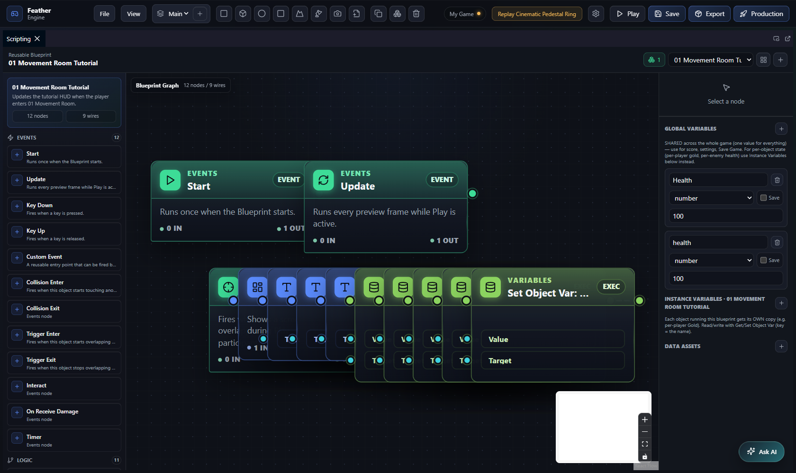
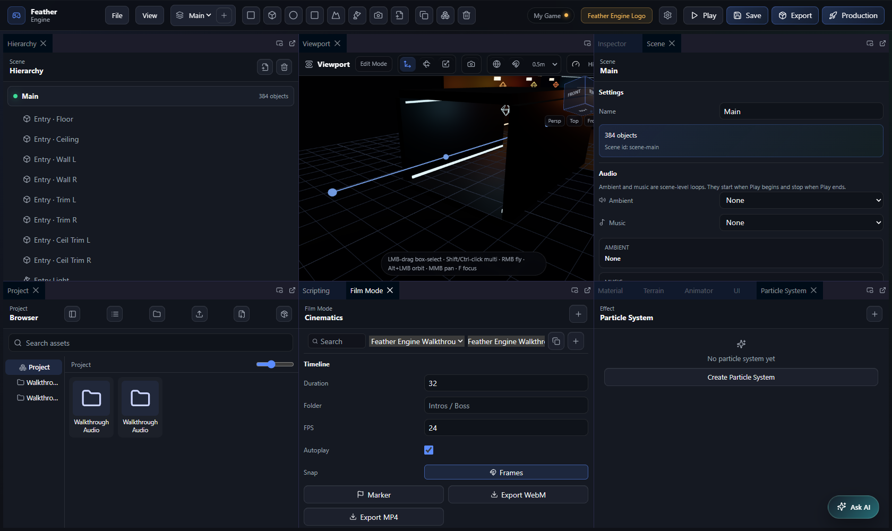
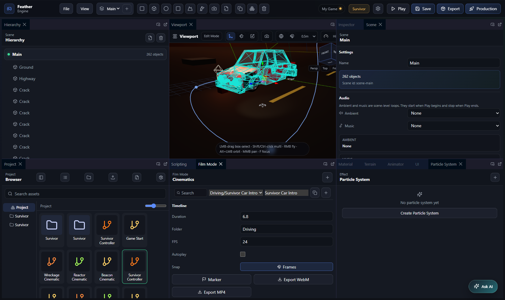
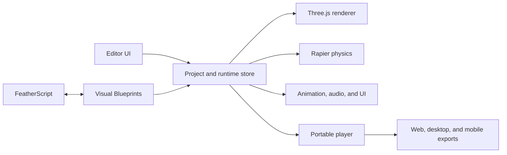

<p align="center">
  
</p>

<h1 align="center">Feather Engine</h1>

<p align="center">
  <strong>A visual-first 3D game engine for building, playing, and shipping interactive worlds.</strong>
</p>

<p align="center">
  Create gameplay with node-based Blueprints or FeatherScript, simulate it with Rapier,
  polish it with cinematic and world-building tools, then export to web, desktop, and mobile.
</p>

<p align="center">
  <a href="#project-status"></a>
  <a href="LICENSE"></a>
  
  
  
</p>

<p align="center">
  <a href="https://youtu.be/bG56Lbc-PN4"><strong>Watch the demo</strong></a>
  ·
  <a href="#get-started"><strong>Get started</strong></a>
  ·
  <a href="#feature-map"><strong>Explore features</strong></a>
  ·
  <a href="#ship-your-game"><strong>Ship a game</strong></a>
  ·
  <a href="#documentation"><strong>Read the docs</strong></a>
</p>

<p align="center">
  <a href="https://youtu.be/bG56Lbc-PN4">
    
  </a>
  <br />
  <sub>Click the editor to watch Feather Engine in action.</sub>
</p>

> [!IMPORTANT]
> Feather Engine is experimental software under active development. The editor is functional and
> extensively tested, but APIs and the project format may change before a stable release.

## Why Feather?

Feather keeps the complete game-making loop in one live workspace:

| | |
| --- | --- |
| **Author visually** | Build scenes, materials, terrain, vegetation, VFX, animation, UI, and cinematics in dockable editor panels. |
| **Choose how you script** | Connect typed Blueprint nodes, write FeatherScript, or move between the two representations. |
| **Iterate in place** | Press Play without leaving the editor; inspect execution flow, values, logs, physics, and frame timing live. |
| **Ship the same project** | Produce a portable web build or package it for Windows, macOS, Linux, Android, and iOS. |
| **Work with an AI co-editor** | Let the built-in assistant create and modify the scene through the same tools used by the editor. |
| **Build together live** | Host an encrypted, Yjs-backed editing session from the desktop app through your own ngrok tunnel. |

There is no separate runtime authoring toolchain to learn: the web editor, Tauri desktop app, and
exported player share the same React, Three.js, and Rapier foundation.

## See it in action

<table>
  <tr>
    <td width="50%">
      <strong>Blueprint-style visual scripting</strong><br />
      Typed value pins, execution wires, reusable functions, variables, events, and live tracing.
      <br /><br />
      
    </td>
    <td width="50%">
      <strong>Cinematics and Film Mode</strong><br />
      Build camera shots, timed actions, transitions, markers, and exportable sequences.
      <br /><br />
      
    </td>
  </tr>
</table>

<p align="center">
  
  <br />
  <sub>A playable driving project running inside the editor.</sub>
</p>

## What you can build

Start with a blank project or launch one of nine playable templates:

| Template | Focus |
| --- | --- |
| **Third-person** | Character movement, a follow camera, combat, and an explorable tutorial world. |
| **Meadows** | A stylized outdoor scene with interactive grass and nature rendering. |
| **Cube Realm** | An action slice with combos, a day cycle, and a shrine encounter. |
| **First-person shooter** | A neon FPS sandbox with multiple weapons, grenades, targets, and HUD logic. |
| **Driving** | An arcade-style neon cruise with vehicle controls, chase cameras, and a garage. |
| **Sim racing** | Tuned vehicle physics, laps, rivals, traffic, and race presentation. |
| **Cinematic** | “The Summit,” a timeline-driven flythrough with cameras, wind, cloth, music, and VFX. |
| **Physics Lab** | Axis locks, stay events, angular velocity, and runtime gravity controls. |
| **Timeline Mechanics** | Curve-driven Vault Door, elevator, drawbridge, gate, crusher, and chest examples. |

Templates are editable projects, not videos or hard-coded demos. Open their scenes, inspect their
Blueprints, replace assets, and reuse the systems in your own game.

## Feature map

| System | Highlights |
| --- | --- |
| **Editor workflow** | Dockable and pop-out panels, hierarchy, inspector, transform gizmos, command palette, multiple scenes, undo/redo, autosave recovery, and project folders. |
| **Rendering and worlds** | Three.js renderer, procedural or image skies, day/night cycles, aerial and volumetric fog, water, terrain, procedural trees, reflection probes, shadows, bloom, color grading, and scalable quality presets. |
| **Gameplay and physics** | Rapier rigid bodies, colliders, triggers, collision layers, joints, raycasts, vehicles, characters, ragdolls, cloth, cables, projectiles, damage, explosions, decals, and fracture effects. |
| **Scripting** | Reusable Blueprint graphs, typed execution/value wires, functions, global and per-instance variables, data tables, save slots, runtime events, and FeatherScript source. |
| **Assets and animation** | GLB, glTF, FBX, PNG, JPEG, WebP, MP3, and WAV import; skeleton inspection, sockets, bone attachments, animation state machines, 1D and 2D blend spaces, foot and look-at IK, a live animation debugger, reusable prefabs, LOD, instancing, and optional KTX2 texture compression. |
| **UI and input** | Screen-space and world-space UI, interactive controls, HUD bindings, minimap, keyboard, mouse, gamepad focus, and automatic touch controls in exported games. |
| **Cinematics** | Shot sequencing, camera paths, cuts and blends, timed object/audio/event actions, overlays, frame-locked WebM capture, and MP4 export through ffmpeg.wasm. |
| **Runtime diagnostics** | On-screen console, live variable watch, execution and value tracing, problem reporting, performance profiler with hitch and stall attribution, render statistics including lights, shadow casters and skinned meshes, a live animation debugger, and replay capture. |
| **AI authoring** | Bring-your-own-key support for OpenAI, Anthropic, and Google models, tool-driven scene editing, smart routing, and a localhost-only MCP bridge for external agents. |
| **Live collaboration** | Host/editor/viewer roles, presence and participant controls, reconnect-safe CRDT editing, and authenticated host-to-guest asset streaming without a Feather cloud server. |
| **Production export** | Self-contained game bundles, a portable web player, native desktop installers, mobile shells, build verification, and a platform-readiness doctor. |

## Get started

### Prerequisites

- [Node.js](https://nodejs.org/) 20 or newer
- npm (included with Node.js)
- A modern browser with WebGL 2 support

For the native desktop editor, also install the
[Rust toolchain](https://rustup.rs/) and the platform prerequisites required by Tauri.

### Run the web editor

```bash
git clone https://github.com/mariojgt/featherEngine.git
cd featherEngine
npm ci
npm run dev
```

Open [http://localhost:17420](http://localhost:17420), create a project, choose a template, and
press **Play**. Vite uses this fixed port because the desktop shell connects to the same development
server.

### Your first five minutes

1. Choose **Third-person** or **First-person shooter** in the launcher.
2. Select an object in the **Hierarchy** and edit its components in the **Inspector**.
3. Open **Scripting**, add an event and an action, then connect their execution pins.
4. Press **Play** to test the result in the same viewport.
5. Save the project, then use **Export → Production** when it is ready to share.

### Run the desktop editor

```bash
npm run tauri:dev
```

The two editor modes use the same engine but store projects differently:

| Web preview | Tauri desktop |
| --- | --- |
| Fastest way to explore the editor | Best choice for sustained project work |
| Saves a portable `.nforge` download | Uses a real project folder on disk |
| Browser file picker for imports | Native dialogs, recent projects, and reveal-in-folder actions |
| Downloads game bundles for the source-tree CLI | Runs local production builds and native platform tooling |

A desktop project is deliberately readable:

```text
My Game/
├── project.json
├── scenes/
│   └── <scene-id>.scene.json
└── assets/
```

## Ship your game

The recommended path is **Export → Production** in the desktop editor. Configure the saved build
profile (stable app id, version/build number, launch scene, window, configuration, exact targets),
then Feather snapshots a self-contained game bundle and runs its runtime/resource parity gate.
Web, Windows, macOS, Linux, Android, and iOS are independent targets. Browsers do not run the web
build by double-clicking `index.html`; serve or upload the complete folder.

Run the platform doctor before shipping:

```bash
npm run doctor
```

The CLI commands below read `exports/staging/game.json` by default. The desktop Production flow
handles staging for you; for a bundle exported elsewhere, pass `--bundle "path/to/game.json"` to
`scripts/export-production.mjs` or place the file in that staging location.

| Target | Output | Command | Build host |
| --- | --- | --- | --- |
| **Web** | Hosted static folder and `.zip` | `npm run ship` | Any supported OS |
| **Windows** | `.msi` / `.exe` | `npm run ship:native` | Windows or the included CI workflow |
| **macOS** | `.app` / `.dmg` | `npm run ship:native` | macOS or the included CI workflow |
| **Linux** | `.AppImage` / `.deb` | `npm run ship:native` | Linux or the included CI workflow |
| **Android** | debug `.apk` / release `.aab` | `npm run export:android` | Android SDK/NDK and Rust mobile targets required |
| **iOS** | Xcode project / `.ipa` | `npm run export:ios` | macOS, Xcode + iOS runtime, CocoaPods, and signing required |

macOS `.app` bundles are signature-verified during export. Without a Developer ID identity they are
ad-hoc signed for local testing; public downloads still need Developer ID signing and notarization.

For faster iteration, `npm run ship:fast` rebuilds with reduced checks and `npm run ship:reuse`
reuses the existing `dist-player/` for content-only re-exports.

Desktop installers are native builds, so Tauri does not cross-compile them from one operating
system. Selecting another OS creates a runner-ready staging folder; use
[the included GitHub Actions matrix](.github/workflows/export-desktop.yml) to package all three
desktop targets. See the [Production Export guide](docs/PRODUCTION_EXPORT.md) for staging,
runtime parity, build profiles, exact target selection, fast/reuse builds, mobile setup, output
locations, and troubleshooting.

If the game already has a Steamworks app and depot, the desktop editor can run a guarded
SteamPipe preview/upload from **Export → Upload to Steam…**. It uses your local Steamworks SDK,
keeps credentials out of the project, and requires an exact unpacked depot folder. See the
[Steam Publishing guide](docs/STEAM_PUBLISHING.md).

## Scripting

Every reusable gameplay Blueprint can be authored as a node graph or as FeatherScript. The graph
gives designers an immediate visual model; the source view is faster for larger edits and works with
the same runtime representation.

The node palette covers:

| Category | Examples |
| --- | --- |
| **Events** | Start, Update, input, collisions, triggers, interaction, damage, landing, timers |
| **Logic** | Branch, switch, sequence, loops, delay, cooldown, cast, functions, comments |
| **Math and data** | Scalars, vectors, interpolation, range mapping, strings, variables, table lookup |
| **Runtime** | Movement, cameras, spawning, animation, audio, scenes, materials, environment, AI queries |
| **Physics** | Forces, impulses, velocity, ray/shape queries, joints, cables, ragdolls, fracture |
| **State and presentation** | Save/load, UI visibility and text, particles, decals, screen effects, replay |

Execution wires describe *when* work happens; colored value wires carry typed data. During Play,
active execution paths and live values can be traced directly in the graph.

## AI-assisted authoring

The built-in assistant is an editor operator, not just a chat panel. It can inspect the active
project and call typed tools to create objects, configure components, build Blueprints, tune the
environment, assemble UI, and author cinematics. Provider requests go directly from the app to the
selected provider using your API key.

The same tool surface is available to local MCP clients:

```bash
npm run mcp  # starts the relay at http://127.0.0.1:5151/mcp
npm run dev  # open an editor; it attaches to the relay automatically
```

The relay binds to localhost because connected clients can modify the open project. Do not expose it
to a LAN or public network. Setup details and the feature-sync checklist live in
[AI Assistant documentation](docs/AI_ASSISTANT.md).

## Architecture


```mermaid
flowchart LR
    A[Editor UI] --> B[Project and runtime store]
    C[Visual Blueprints] --> B
    D[FeatherScript] <--> C
    B --> E[Three.js renderer]
    B --> F[Rapier physics]
    B --> G[Animation, audio, and UI]
    B --> H[Portable player]
    H --> I[Web, desktop, and mobile exports]
```

### Core stack

| Layer | Technology |
| --- | --- |
| **Editor** | React 18, TypeScript, Vite, Zustand, Dockview, Tailwind CSS, Framer Motion |
| **3D** | Three.js, React Three Fiber, Drei, and postprocessing |
| **Physics** | Rapier 3D and React Three Rapier |
| **Visual graphs** | XYFlow |
| **Desktop and mobile** | Tauri 2 and Rust |
| **AI integration** | Vercel AI SDK, OpenAI, Anthropic, Google, and Model Context Protocol |

### Source map

| Path | Responsibility |
| --- | --- |
| [`src/components/`](src/components/) | Editor workspace, panels, tools, dialogs, and diagnostics |
| [`src/store/`](src/store/) | Project state, editor actions, graph runtime, history, and persistence |
| [`src/runtime/`](src/runtime/) | Physics, gameplay services, input, audio, replay, and profiling |
| [`src/three/`](src/three/) | Rendering, environment, models, animation helpers, terrain, and VFX |
| [`src/scripting/`](src/scripting/) | FeatherScript parser, compiler, source conversion, and API metadata |
| [`src/ui/`](src/ui/) | Runtime screen/world UI, HUDs, minimap, touch controls, and focus navigation |
| [`src/project/`](src/project/) | Templates, serialization, packages, game bundles, and export validation |
| [`src/extensions/`](src/extensions/) | Typed Plugin SDK, lifecycle host, commands, panels, events, and bundled plugins |
| [`src/player/`](src/player/) | Standalone exported-game player |
| [`src/platform/`](src/platform/) | Web and Tauri filesystem/platform abstraction |
| [`scripts/`](scripts/) | Player builds, production exports, platform doctor, and MCP relay |
| [`src-tauri/`](src-tauri/) | Native editor and exported-player shells |

## Development

```bash
npm run test        # run the Vitest suite once
npm run test:watch  # run tests while developing
npm run build       # TypeScript project build + production Vite build
npm run preview     # serve the production editor build locally
npm run build:player
```

The public website lives in its own repository (`FeatherEngineWebsite`, an Astro project) and is
built and deployed from there.

For native-shell changes:

```bash
cd src-tauri
cargo check
```

Changes to user-facing capabilities must keep the AI assistant in sync: add or reuse an explicit
store action, expose the tool, provide its activity label, update the assistant guide/snapshot, and
verify the workflow end to end. The complete checklist is in
[`docs/AI_ASSISTANT.md`](docs/AI_ASSISTANT.md).

## Documentation

- [Animation System](docs/ANIMATION.md) — animator controllers, blend spaces, crossfading, IK, and the debug readout
- [Live Collaboration](docs/COLLABORATION.md) — start/join workflow, authority model, security, and limitations
- [Plugin SDK](docs/PLUGIN_SDK.md) — commands, dockable panels, safe project APIs, and plugin lifecycle
- [Production Export](docs/PRODUCTION_EXPORT.md) — web, desktop, Android, and iOS packaging
- [Steam Publishing](docs/STEAM_PUBLISHING.md) — local SteamPipe preview/upload workflow and safeguards
- [AI Assistant](docs/AI_ASSISTANT.md) — tool architecture, MCP, and the contributor checklist
- [Physics Worker](docs/PHYSICS_WORKER.md) — off-main-thread physics design and rollout status
- [Sample game bundle](examples/sample-game.json) — a small serialized project example

## Project status

Feather Engine is currently at **v0.1.0** and should be treated as an experimental engine:

- Core editing, Play mode, project persistence, tests, and web builds are working.
- Desktop and mobile packaging depend on the native toolchain for each target.
- The file format, scripting APIs, and node palette can evolve between commits.
- Off-thread physics is staged behind a disabled-by-default flag while its remaining rollout is
  completed and validated in live browser scenes.

If you are evaluating Feather for a serious project, prototype your riskiest scene and export path
early, and keep source-controlled project backups while the format is evolving.

## Contributing

Issues and focused pull requests are welcome. Before submitting a change:

1. Keep the change scoped and explain the user-facing outcome.
2. Add or update tests where the behavior is testable.
3. Run `npm run test` and `npm run build`.
4. Update relevant docs and, for editor features, the AI assistant integration.

Use [GitHub Issues](https://github.com/mariojgt/featherEngine/issues) for bug reports, proposals,
and reproducible examples.

## License

Feather Engine is released under the [MIT License](LICENSE).
