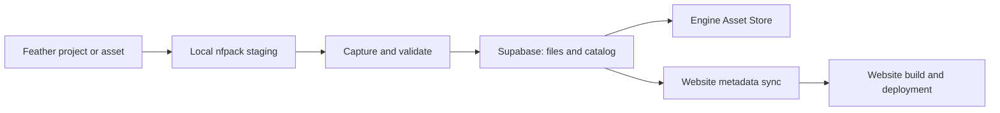

# Hosted asset store

The engine reads the catalog configured in `store.config.json` from Supabase Storage. Its
`.nfpack` archives and thumbnail files are public free downloads; the website displays the
curated packages selected by `websiteSlugs`. Older template packages remain available to the
engine, while launcher visibility keeps the previously hidden starters out of its cards.
No customer account, database table, or browser API key is needed for this free store.

The dedicated Supabase project is **Feather Store** (`ndzxqemfrmrinzklzfsb`), in the
Feather Terminal organization, region `eu-west-1` (Ireland). Open its
[dashboard](https://supabase.com/dashboard/project/ndzxqemfrmrinzklzfsb) to manage storage.
The public bucket is `feather-store`. Publish only to the project in `store.config.json`;
check any local or deployment `VITE_STORE_URL` override before building. The database
password is stored in the local macOS login Keychain under **Feather Store Supabase
database**, account `postgres`; no credentials belong in either repository.

`public/store/catalog.json` is a small published metadata snapshot. No store archives or
previews ship in `public/`. Asset files used by the editor's built-in builders are separate
and remain in the engine source tree. Removing files from the current tree does not erase
the binaries in earlier Git history.

## Develop and validate

```sh
npm run store:pull
npm test
npm run build
```

`store:pull` restores packages described by the checked-in catalog to the ignored
`.feather-cache/store-fixtures/` directory and verifies each download's size and SHA-256.
`npm test` runs it automatically; an already verified cache needs no network. The package
install tests use those real archives without making network requests during the tests.

Authoring exports and publication staging use the separate `.feather-cache/store/`
directory. Restoring test fixtures never overwrites a newly exported template.

## Update packages

1. For a project template, run the editor and open `/?exportTemplate=<key>`. The development
   export endpoint stages the archive under `.feather-cache/store/packages/projects/`.
   Cinematic captures write preview images under `.feather-cache/store/previews/`.
2. Run `npm run build:store`. This regenerates authored plugin descriptors and
   stages a catalog alongside project archives. Missing project archives are seeded from
   the verified fixture cache. This command does not change the live store.
3. Run tests and the engine build. When ready, sign in with `supabase login` and link this
   repository with `supabase link --project-ref ndzxqemfrmrinzklzfsb`.
4. Capture and review the real package with `npm run store:capture -- --slug <slug>`, then
   run `npm run build:store` again to attach those images to the staged catalog.
5. Review `npm run store:publish -- --dry-run`, then run `npm run store:publish` to publish.
6. In `/Users/mariotarosso/Documents/TheDevRealm/FeatherEngineWebsite`, run
   `npm run sync:store`, `npm run build`, and the website store browser check against preview.
   Deploy that website build through the normal website release process.

The publisher uses the signed-in CLI for object uploads. It obtains the server key in memory
from the CLI to create/inspect the dedicated bucket and update its catalog; no secret is written to source or
passed to browser code. Existing private buckets are never made public. Content-addressed
archive and image paths are immutable. Every uploaded object is downloaded publicly and
checked before the catalog is published last; failures leave the local catalog unchanged.
Old versioned objects are retained so existing downloads stay valid.

## How the parts fit together



| Location | Purpose | Checked into Git? |
| --- | --- | --- |
| Engine `store.config.json` | Project, bucket, public URL, website curation | Yes; no secrets |
| Engine `scripts/store/` | Add, restore, capture and publish commands | Yes |
| Engine `.feather-cache/store/packages/` | Authoring archives awaiting publication | No |
| Engine `.feather-cache/store/previews/` | Real screenshots and their capture manifest | No |
| Engine `.feather-cache/store-fixtures/` | Checksum-verified copies of published archives for tests | No |
| Supabase `feather-store` bucket | Actual public downloads, previews and live `catalog.json` | Cloud storage |
| Engine `public/store/catalog.json` | Small snapshot of the last successful publication | Yes; metadata only |
| Website `src/data/store-catalog.json` | Curated metadata used to generate `/store/` and detail routes | Yes; metadata only |

The website repository is `/Users/mariotarosso/Documents/TheDevRealm/FeatherEngineWebsite`.
The engine and website are separate repositories. A bucket publication makes files available;
it does **not** deploy the website or release a new desktop engine build.

## Add a new asset pack or project

1. Prepare the content in Feather. For a reusable prop, select its root and create a prefab.
   Export the prefab/folder as a `.nfpack` from the Asset Browser. For a full game, choose
   **Share as template (.nfpack)**. Include the entire dependency closure: materials, models,
   audio, textures, Blueprints, UI documents and reusable components.
2. Check that a prefab does not reference a player or camera outside its own subtree. Use
   reusable references such as `$player` for gameplay targets. Keep asset credits and license
   information with the package, and choose an explicit license for the content you own or
   are permitted to redistribute.
3. Stage the exported file. The slug is a stable lowercase identifier; keep it across updates:

   ```sh
   npm run store:add -- "/absolute/path/field-kit.nfpack" \
     --slug field-kit --license CC0-1.0 --version 1.0.0
   npm run build:store
   ```

   `store:add` checks the archive and asset hashes, rejects missing embedded payloads, applies
   your explicit license/version, preserves an existing listing ID, and places the file in
   the correct ignored `assets/`, `projects/`, or `plugins/` folder. It never uploads anything.
   Two built-in plugin listings are generated from source; edit their catalog definitions
   rather than replacing their files with this command.
4. Run the editor on a free port and capture the actual staged package:

   ```sh
   npm run dev -- --host 127.0.0.1 --port 17427 --strictPort
   # In another terminal:
   E2E_BASE_URL=http://127.0.0.1:17427 npm run store:capture -- --slug field-kit
   npm run build:store
   ```

5. Inspect `.feather-cache/store/previews/field-kit-*.webp`. Test the content in a fresh project
   and test a playable export where applicable. Improve its framing in `scripts/store/capture.mjs`
   if needed. An asset pack with UI uses real document previews; a project uses the player;
   a plugin uses its real compiled editor panel. Props and model/material packs use a neutral
   preview stage with included prefabs, models, or material swatches. Check the scale and framing
   and add an authored capture recipe when the pack needs a more specific demonstration.
6. To feature the package on the website, add its slug to `websiteSlugs` in `store.config.json`.
   Review the staged catalog and use the publication commands below.

For an engine-authored starter such as Cinderfall, use `/?exportTemplate=cinderfall` rather
than `store:add`. This runs the real builder and stages a project archive. The catalog builder
also scans custom exported archives in all three package folders.

## Capture and publish a complete collection

```sh
npm run build:store
E2E_BASE_URL=http://127.0.0.1:17427 npm run store:capture
npm run build:store
npm run store:publish -- --dry-run
npm run store:publish
```

Chrome is required. On macOS, `FEATHER_E2E_ANGLE=metal` uses the hardware renderer for heavy
cinematics. `CHROME_PATH` can select another Chrome installation. `--resume` reuses captures
whose recorded archive checksum still matches; `--slug <slug>` refreshes one listing. The
default collection is the curated website set; `--all` also attempts internal compatibility
packages, including older starters that remain hidden from the public collection.

The capture manifest records the source archive's SHA-256 and image captions. The catalog
builder labels captures stale when the archive changes. A featured listing must have verified
current captures before the publisher accepts it. Re-exporting a game creates new archive
bytes; capture it again after the final export. Thumbnails and gallery images become immutable
content-addressed Supabase objects, alongside the archives. Images are screenshots of content,
not invented reviews or promotional mockups.

After publication, switch to the website repository:

```sh
npm run sync:store
npm run sync:store -- --check
npm run build
./node_modules/.bin/tsc --noEmit -p tsconfig.json
npm run preview -- --host 127.0.0.1 --port 17431
# In another terminal:
SITE_ORIGIN=http://127.0.0.1:17431 npm run test:store
```

Deploy the website's `dist/` using its existing hosting workflow. The live engine sees the
new catalog immediately; the public website gets new detail routes only after its updated
build is deployed. Engine features used by a new package must also be included in the build
your customers install; package publication does not ship new runtime code.

## Updates, rollback and common failures

- Keep the slug and listing ID, increase the package version, and stage the updated archive.
  Capture again, validate, publish, then sync/build/deploy the website.
- Immutable old archive URLs remain usable. To roll back, stage the previous archive and its
  matching captures, rebuild and republish the catalog. Do not delete old objects during a
  routine update; downloads saved in previous website builds may still point to them.
- **“Stale” or “capture the current package”**: run `store:capture -- --slug <slug>` after the
  final export, then `build:store`. Capture and catalog generation do not upload files.
- **Unlinked project**: run `supabase login` and `supabase link --project-ref ndzxqemfrmrinzklzfsb`.
- **Duplicate on CLI `storage cp`**: immutable uploads are create-only. The publisher checks
  and reuses matching existing objects; it updates only the catalog through Storage upsert.
- **No website detail page**: sync and rebuild the website, then deploy that build.
- **Plugin unavailable**: the installed Feather build must contain the named plugin module.
- **Missing asset payload**: re-export with embedded dependencies before staging the package.
- **Heavy capture timeout**: use Metal on macOS or capture one package at a time. Review the
  actual rendered result before publishing; a successful upload does not establish quality.

## Use a downloaded package

- Project: choose **Open template file** in the launcher, choose the `.nfpack`, and save the
  newly created project. Earlier builds can use the same listing's **Use template** action
  in the editor's Asset Store. Opening a template file validates it before creating a project;
  cancelling or choosing a UI kit leaves the workspace unchanged.
- UI kit: open a project, then **Asset Browser → Import package…**. Imported UI documents,
  components, styles, and bindings remain editable.
- Plugin: use **Asset Store → Install plugin**. A plugin descriptor activates a module
  compiled into Feather; it is not a downloadable executable plugin. Manage it under
  **Preferences → Plugins** and open it through **View → Extensions**.

## Paid content later

This bucket and publisher accept only `priceCents: 0`. Add a separate private bucket,
customer authentication, verified purchase entitlements, and a server endpoint issuing
short-lived download URLs before publishing paid files. Hiding a public URL behind a
checkout page would not protect a paid asset. Public uploads/deletes are not granted.
