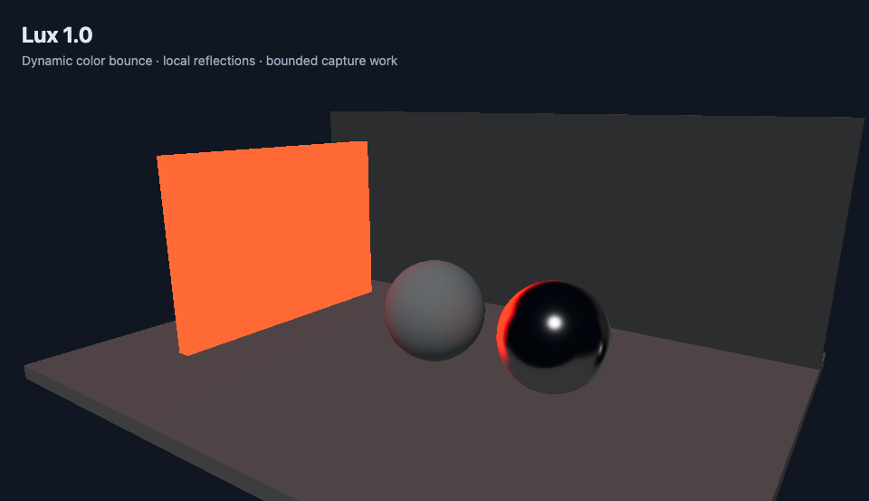
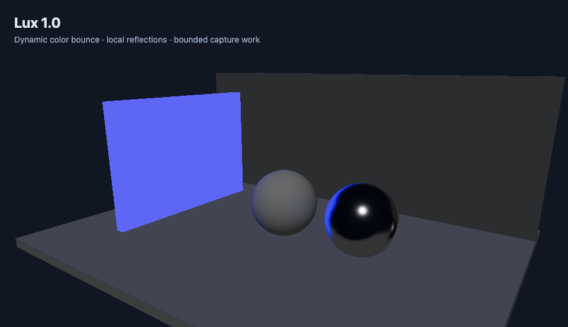

# Lux 2.0

Lux adds dynamic local indirect lighting and reflections to Feather's existing WebGL renderer. Lit surfaces and emissive materials contribute colored light to nearby standard and physical materials. It works in the editor and the standalone player without baking lightmaps or installing another renderer.

The same scene after changing its emissive panel from red to blue. The floor receives colored indirect light and the metal sphere reflects the capture:

| Red emitter | Blue emitter |
| --- | --- |
|  |  |

## Use it

1. Deselect objects and click **Scene settings** in the Inspector.
2. Under **Lux 2.0**, turn on **Enable Lux**. Engine quality must be Medium, High or Epic.
3. Start with **Match engine quality** and **Follow camera**. Lighting appears after the first complete capture and updates continuously.
4. For interiors, choose **Rooms**, then **Add room**. Set its centre and size to match the walls. Up to four rooms can overlap; their edges blend. The capture starts at the room centre. Turn off **Automatic capture position** to move it into empty space if needed. **Check walls and obstacles** reduces light leaking through interior geometry.
5. Adjust **Indirect light** and **Reflection strength**. **Show coverage** visualizes room bounds or the camera/fixed influence sphere. **Refresh lighting** clears and rebuilds the caches.

Use white or lightly colored rough surfaces to judge color bounce; use a smooth metallic material to judge reflections. A surface facing away from the source should receive less indirect light. Existing material environment maps and authored reflection probes take priority over Lux reflections.

The scene stores all Lux settings. Save/reopen, undo/redo, project packages and game exports retain them. The AI's `set_scene_environment` tool accepts a partial `lux` object, for example:

```json
{"lux":{"enabled":true,"mode":"fixed","position":[0,2,0],"radius":12,"indirectIntensity":0.65}}
```

Partial edits preserve the other Lux settings. Older scenes remain unchanged until Lux is enabled. Low quality temporarily suspends Lux; increasing quality resumes it without losing the authored configuration.

## Rendering budget

The global engine quality caps the requested Lux quality. Selecting Cinematic Lux at Medium engine quality still uses the Performance budget.

| Effective quality | Capture face size | Capture work | Minimum pause between capture batches |
| --- | --- | --- | --- |
| Low engine quality | None | None | Suspended |
| Performance | 32 × 32 | One face every second frame | 1 second |
| Balanced | 64 × 64 | At most one face per frame | 0.5 seconds |
| Cinematic | 128 × 128 | At most one face per frame | 0.25 seconds |

A radiance batch contains six scene renders, followed by asynchronous pixel readback and PMREM filtering. Rooms with wall checks also capture six depth faces. All rooms share the same scene-render budget in the table, including depth: adding rooms increases refresh latency rather than multiplying work per frame. PMREM filtering is additional work. Each room becomes active only after its initial radiance and depth are ready. The capture origin remains fixed throughout a batch. Readback must finish before another batch can overwrite the texture. Settings can request a longer update interval. The minimum pause, frame rate and readback latency together determine how quickly lighting responds.

The status readout reports completed captures, effective resolution and HDR availability. Its timing is **CPU submission time summed across the batch plus filtering**, not measured GPU time or an FPS promise. Complex geometry, many materials and skinned meshes make each face more expensive. The engine's automatic quality control can reduce the budget during Play.

## How it works

Lux captures the scene's directly lit and emissive radiance into a small HDR cubemap. Its own indirect contribution is disabled during capture, preventing recursive amplification. Nine spherical-harmonic coefficients approximate the diffuse irradiance; PMREM filters the same capture for roughness-dependent specular reflection. Diffuse changes are smoothed over time and a complete batch is published together.

Shader hooks add the lighting to standard/physical materials. Influence fades per fragment between 65% and 100% of the coverage radius, so large meshes and shared/instanced materials do not receive one scene-wide tint. Lux leaves authored environment maps, material properties and other shader hooks intact. Each Canvas owns its cache and restores its hooks when disabled, when changing scenes or when unmounted. Pending readback finishes before its GPU targets are disposed.

When HDR render targets are unavailable, Lux uses an LDR diffuse-only capture and retains the authored reflections. A capture failure falls back to authored lighting and shows an error in the Lux status. Refresh lighting retries it.

The existing Epic-quality screen-space reflections remain available through **Screen reflections (Epic)** and require Render Look preview in the editor. They complement the local capture; the cubemap can also contain geometry outside the main camera view.

## Scope and limits

Lux 2.0 uses bounded local captures, spherical harmonics, box-projected reflections, and a shared depth atlas. It does not implement Lumen's hardware/software ray tracing, mesh distance fields, surface cache or recursive multi-bounce transport.

Room bounds prevent contribution outside the volume. Radial depth from each capture reduces spill through opaque interior obstacles; it is an approximation, not a complete visibility solution. Thin walls, concave rooms, objects near the capture and moving geometry can still show leaks, parallax errors or stale light. Place captures in empty space and split complicated interiors into rooms. A four-room limit keeps WebGL shader and texture costs bounded.

Camera/fixed modes retain spherical coverage and do not check walls. Large camera jumps invalidate their previous cache. Custom ShaderMaterial/toon shaders, transparent transport and refraction keep their existing rendering. Prepared LODs improve geometry cost, but Lux still renders scene geometry for captures.

The architectural reference is Epic's combination of cached scene lighting and screen traces. Lux chooses a smaller capture-based implementation that fits Feather's forward WebGL renderer. See [Lumen technical details](https://dev.epicgames.com/documentation/en-us/unreal-engine/lumen-technical-details-in-unreal-engine) and [Lumen global illumination and reflections](https://dev.epicgames.com/documentation/en-us/unreal-engine/lumen-global-illumination-and-reflections-in-unreal-engine) for the full Unreal system.

## Verify changes

Run `npm test`, `npm run build`, and `npm run build:player`. With the dev server running, `npm run test:lux` checks real WebGL pixels for emissive color bounce, changing radiance, reflections, capture scheduling, exact lighting restoration, GPU resource cleanup, the editor controls, separate room colors, bounds, depth occlusion and the shared room budget. Artifacts are written to `exports/lux-acceptance/`.

The standalone fixture at `/scripts/fixtures/lux-lighting.html` provides a reproducible lighting comparison. `npm run test:production` validates the exported player. Renderer changes must rebuild `dist-player` so new exports carry the updated implementation.
