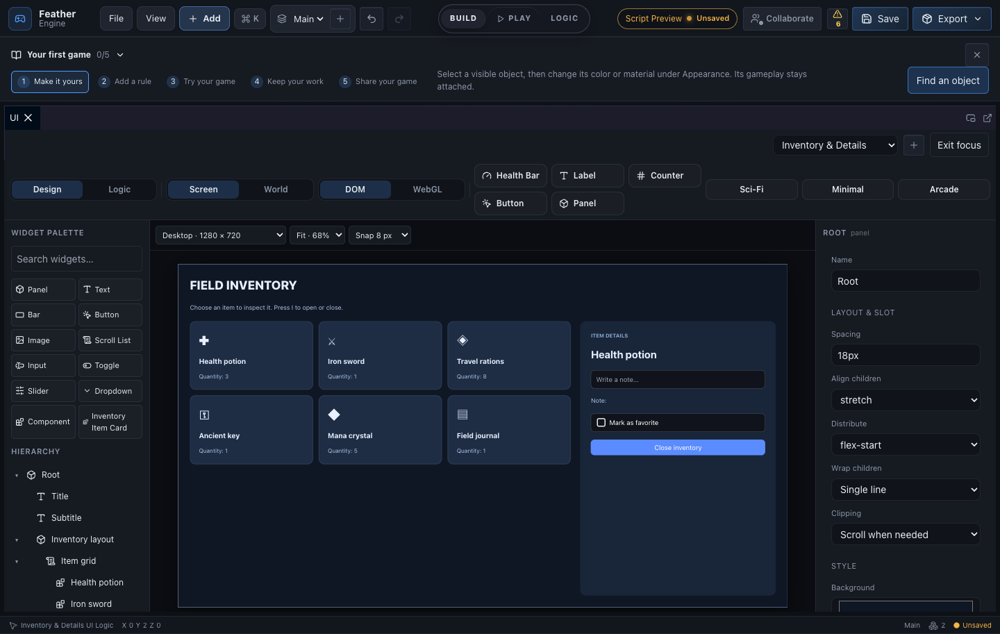

# Widgets, packages and plugins

Open **View → UI**, choose **Inventory & Details** from the new-document menu, and click **Focus designer**. This example combines a responsive item grid, six instances of one reusable card, a details panel and live controls. During Play, choose an item, enter a note, close the menu, and press **I** to reopen it.

The workflow follows the useful parts of Unreal's UMG authoring model: a palette, hierarchy, visual designer, details, reusable widgets and a logic graph. See Epic's [anchors guide](https://dev.epicgames.com/documentation/unreal-engine/umg-anchors-in-unreal-engine-ui) and [reusable widget templates](https://dev.epicgames.com/documentation/unreal-engine/creating-umg-widget-templates-in-unreal-engine). Feather uses its own project format and runtime; this does not import Unreal Widget Blueprints.

**Build a complex interface**

1. Add a Panel or Scroll List from the palette. New widgets go into the selected container, or the document root.
2. Use Layout to choose a vertical stack, horizontal row, grid or free-placement canvas. Set spacing, wrapping, alignment and clipping in Details.
3. For each child, choose Auto sizing or Fill to share available space. Set margins and alignment. Grid children can span columns or rows, for example `1 / span 2`.
4. Collapse hierarchy branches to work on one area. Drag a hierarchy row onto a panel, or use the Parent field. Root moves, descendant cycles and invalid destinations are refused.
5. Use anchors to pin widgets to their parent. Moving an anchored widget preserves its anchor. Resizing switches to explicit placement. Choose desktop, tablet or phone previews and Fit or a fixed zoom. Snapping uses logical pixels; hold Alt to bypass it.
6. Select a subtree and use Extract to component. Instances share the source widget and accept their own parameter expressions. Inside the source, bind text to `param.label`; on an instance set `label` to `'Health potion'`. Add a parameter with Enter or the plus button. Use an instance click-event name when each copy needs a different action.

**Connect behavior**

The Logic tab uses the existing Blueprint graph. Button event names connect to Custom Event nodes. Show UI, Hide UI, Toggle UI, Set UI Text and Set UI Visible control documents and elements. Runtime text and visibility overrides address instance ids and take priority over bindings. An instance can disable its nested controls through a disabled binding.

Input, toggle, slider and dropdown controls write project variables by name. Text bindings read those variables; arbitrary JavaScript is not executed. The inventory template demonstrates item selection, a shared note and a shared favorite flag. Its example cards and quantities are static; connect an inventory data model for item ownership, quantities and per-item notes.

Use DOM rendering for complex responsive menus, editable controls and CSS grid spans. The WebGL backend supports a smaller layout vocabulary, approximates grids with flex wrapping and displays input controls as readouts. Its reusable button events, visibility overrides and fill/clipping translations are covered separately by tests.

**Share a UI package**

Put the UI in a Project-browser folder and export that folder as a package. Referenced components, logic Blueprints, assets and variables used by bindings, controls and component parameters are collected automatically. Importing the package into a project adds the UI logic controllers needed for its buttons to run immediately.

Packages validate metadata, collections, widget trees, component dependencies/cycles and graph endpoints before import. ZIP entry counts, paths and sizes are checked. Carried and inline asset hashes are verified before content is merged; corrupt embedded bytes do not become a partially installed UI. Legacy `module` packages remain supported. Asset downloads referenced by external URLs still depend on their source being available.

**Create an editor plugin**

Open **Asset Store → Create plugin**. Enter a unique lowercase id such as `studio.inventory-tools`, a name and a version such as `1.0.0`. Download the starter ZIP. It contains:

- `src/extensions/userPlugins/<id>.tsx`: a typed editor panel and command, with a working Add a cube button.
- `<id>.nfpack`: the matching activation manifest.
- `README.txt`: installation, development and cleanup instructions.

Copy the TSX file into the same location in your Feather source checkout. Restart `npm run dev`, or run `npm run build`. Open Create plugin → Local plugins, enable it, then click Open. Modules in that source folder are discovered automatically. The manifest activates a module compiled into the editor; distributing the manifest alone does not install new executable code.

Use the public API in `src/extensions/types.ts`. Activation is synchronous. The host removes registered commands, panels and event subscriptions automatically, and revokes retained API access when activation fails or a plugin is disabled. Return cleanup for timers, observers and requests that your plugin creates. Transform mutations validate the entire patch before applying it. Project transactions batch events; they are not database transactions and do not promise rollback of arbitrary plugin code.

**Verification**

The unit suite covers hierarchy operations, extraction, component cycles, bindings, DOM/WebGL event routing, package integrity, plugin lifecycle and starter generation. A fresh-project package test executes the inventory's actual selection, hide/toggle, Set UI Text and Set UI Visible nodes.

Run `npm test` and `npm run build`. Run `E2E_GREP='widget designer' npm run test:e2e` for the real-browser journey, including phone preview, component selection, input binding, keyboard toggling, dragging at 50% zoom and the downloaded starter ZIP. Run against a freshly started development server after changing store modules: direct module imports used by the test must refer to the same module instance as the editor.

Latest validation: **599 unit tests across 95 files passed**. Editor and standalone-player builds passed. Browser checks covered the existing node/UI-kit/plugin workflows and the new designer journey, with focused reruns passing the layout, breakpoint, minimap and live-widget checks.
The final production smoke also passed in a real browser: WebGL, embedded assets, physics, Blueprint execution, HUD, secondary simulation, cinematic overlay and migration. The portable export contained 28 verified files.
